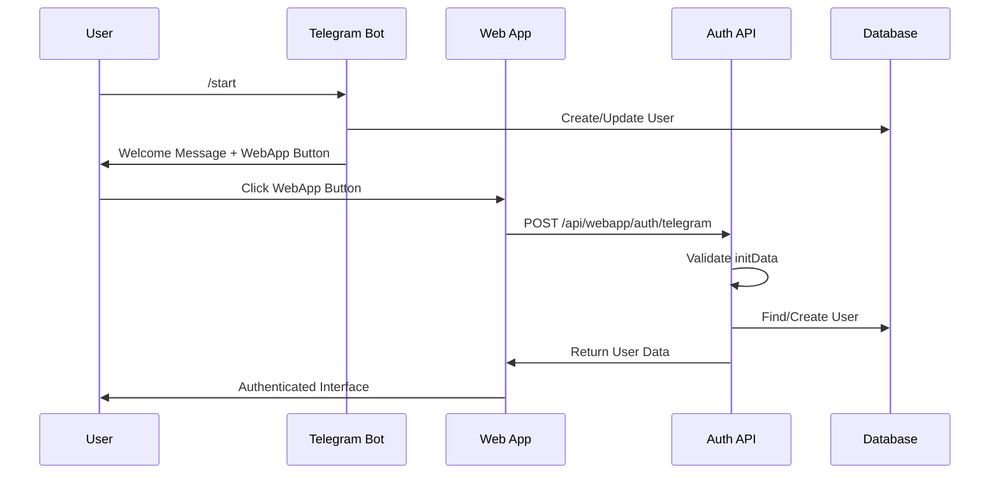

# Система аутентификации Telegram Web App

## Обзор

Реализована комплексная система аутентификации для интеграции Telegram-бота с веб-приложением Next.js, обеспечивающая seamless переход пользователей между ботом и веб-приложением.

## Архитектура

### Компоненты системы

1. **UserService** - централизованный сервис для управления пользователями
2. **TelegramBotWorker** - обработчик команд бота с интеграцией UserService
3. **API роуты** - `/api/webapp/auth/telegram` для аутентификации
4. **TelegramAuthContext** - React контекст для управления состоянием аутентификации
5. **Middleware** - защита роутов и API endpoints

### Поток аутентификации



## Компоненты

### 1. UserService

Централизованный сервис для работы с пользователями:

```typescript
// Создание/обновление пользователя из Telegram
const user = await UserService.findOrCreateTelegramUser(tgUser);

// Получение пользователя по Telegram ID
const user = await UserService.getUserByTelegramId(tgId);

// Обработка команды /start
const user = await UserService.handleTelegramStart(tgUser);

// Валидация Telegram initData
const isValid = UserService.validateTelegramInitData(initData);
```

### 2. TelegramBotWorker Integration

Обновленный бот с интеграцией UserService:

```typescript
// Обработка команды /start
private async handleStartCommand(msg: TelegramBot.Message) {
  const user = await UserService.handleTelegramStart(tgUser);
  // Уведомление админа о новом пользователе
  // Отправка приветственного сообщения
}
```

### 3. API Authentication

Роут `/api/webapp/auth/telegram`:

**POST** - Аутентификация через initData:
```json
{
  "initData": "telegram_web_app_init_data"
}
```

**GET** - Проверка статуса пользователя:
```
/api/webapp/auth/telegram?tg_id=123456789
```

### 4. TelegramAuthContext

React контекст для управления аутентификацией:

```tsx
const { user, isAuthenticated, login, logout } = useTelegramAuth();

// Автоматическая аутентификация при загрузке
// Обработка Telegram Web App initData
// Управление состоянием пользователя
```

## Безопасность

### Валидация initData

Система валидирует подпись Telegram через HMAC-SHA256:

```typescript
const secretKey = crypto.createHmac('sha256', 'WebAppData').update(botToken).digest();
const calculatedHash = crypto.createHmac('sha256', secretKey).update(dataCheckString).digest('hex');
```

### Защита роутов

Middleware защищает API роуты и страницы веб-приложения:

```typescript
// Защищенные роуты
/api/webapp/*  // Требует аутентификации
/webapp/*      // Требует аутентификации (кроме /webapp/auth)
```

## Совместимость с существующей базой

Система полностью совместима с существующей структурой базы данных:

- Использует существующую таблицу `users`
- Поле `tg_id` для связи с Telegram
- Поля `started` и `is_blocked` для контроля доступа
- Сохраняет все существующие данные пользователей

## Настройка

### 1. Переменные окружения

```env
TELEGRAM_BOT_TOKEN=your_bot_token
WEBAPP_TELEGRAM_BOT_TOKEN=your_webapp_bot_token
WEBAPP_URL=https://your-domain.com/webapp
```

### 2. Настройки бота в базе данных

Таблица `settings`:
- `preview_msg` - текст приветственного сообщения
- `bot_btn_title` - текст кнопки каталога
- `group_btn_title` - текст кнопки группы
- `admin_ids` - ID администраторов (через запятую)

### 3. Инициализация в приложении

```tsx
// app/layout.tsx
<TelegramAuthProvider>
  {children}
</TelegramAuthProvider>
```

## Использование

### В компонентах React

```tsx
import { useTelegramAuth } from '@/context/TelegramAuthContext';

function MyComponent() {
  const { user, isAuthenticated, isLoading } = useTelegramAuth();
  
  if (isLoading) return <div>Загрузка...</div>;
  if (!isAuthenticated) return <div>Требуется авторизация</div>;
  
  return <div>Привет, {user.first_name}!</div>;
}
```

### В API роутах

```typescript
// Получение пользователя из контекста
const user = await UserService.getUserByTelegramId(tg_id);

// Проверка прав доступа
if (!user.started || user.is_blocked) {
  return NextResponse.json({ error: 'Access denied' }, { status: 403 });
}
```

## Тестирование

Запуск тестов системы аутентификации:

```bash
npx tsx scripts/test-auth-system.ts
```

Тест проверяет:
- Создание пользователей через UserService
- API аутентификацию
- Обработку команды /start в боте
- Интеграцию компонентов

## Миграция

Для существующих пользователей:

1. Все существующие пользователи с `tg_id` продолжают работать
2. При первом входе в веб-приложение данные обновляются
3. Команда `/start` в боте обновляет статус `started = true`
4. Никаких изменений в структуре базы данных не требуется

## Мониторинг

Система логирует:
- Создание новых пользователей
- Успешные аутентификации
- Ошибки валидации
- Активность пользователей

Логи доступны в консоли сервера и могут быть интегрированы с системами мониторинга.

## Производительность

- Кэширование настроек бота в Redis (если доступен)
- Минимальные запросы к базе данных
- Оптимизированная валидация initData
- Lazy loading пользовательских данных

## Troubleshooting

### Частые проблемы

1. **"User not found"** - пользователь не выполнил `/start` в боте
2. **"Invalid signature"** - неверный токен бота или проблемы с initData
3. **"User banned"** - пользователь заблокирован (`is_blocked = true`)
4. **"Not started"** - пользователь не активировал бота (`started = false`)

### Решения

1. Попросить пользователя выполнить `/start` в боте
2. Проверить правильность токенов в переменных окружения
3. Проверить статус пользователя в базе данных
4. Использовать тестовый режим для отладки 