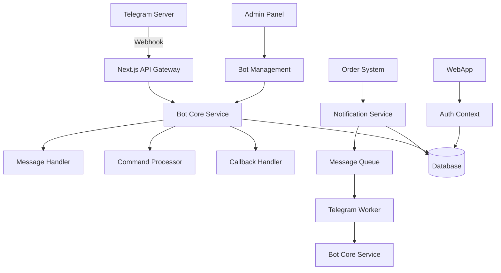

# Полная архитектура Telegram-бота для Next.js проекта

## Содержание
1. [Обзор архитектуры](#обзор-архитектуры)
2. [Текущее состояние](#текущее-состояние)
3. [Архитектурные компоненты](#архитектурные-компоненты)
4. [Модели данных](#модели-данных)
5. [Реализация сервисов](#реализация-сервисов)
6. [Система сообщений](#система-сообщений)
7. [Интеграция с Next.js](#интеграция-с-nextjs)
8. [Фоновые задачи](#фоновые-задачи)
9. [Безопасность](#безопасность)
10. [Развертывание](#развертывание)
11. [Мониторинг](#мониторинг)
12. [Тестирование](#тестирование)

## Обзор архитектуры

### Схема системы


### Принципы архитектуры
1. **Микросервисная архитектура** - Разделение на независимые компоненты
2. **Event-Driven** - Использование событий для уведомлений
3. **Shared Database** - Общая база данных для Rails и Next.js
4. **Webhook-based** - Обработка через вебхуки вместо polling
5. **Queue-based Processing** - Фоновая обработка через очереди

## Текущее состояние

### ✅ Реализовано
- **Аутентификация WebApp**: `TelegramAuthContext`, API `/webapp/auth/telegram`
- **Модели пользователей**: Поля `tg_id`, `telegramData` в Prisma
- **Интерфейс WebApp**: Полный UI в `src/app/webapp/`
- **Базовые уведомления**: Toast-система в интерфейсе

### ❌ Требует реализации
- **Ядро бота**: Обработка команд и сообщений
- **Система вебхуков**: API для приема обновлений от Telegram
- **Уведомления через Telegram**: Отправка сообщений пользователям
- **Фоновые задачи**: Очереди для обработки уведомлений
- **Интерактивные элементы**: Callback-кнопки и inline-клавиатуры

## Архитектурные компоненты

### 1. Bot Core Service
**Файл**: `src/lib/services/telegram-bot.service.ts`

```typescript
import TelegramBot from 'node-telegram-bot-api';
import { prisma } from '@/lib/prisma';
import { MessageHandler } from './message-handler';
import { CommandProcessor } from './command-processor';
import { CallbackHandler } from './callback-handler';

export class TelegramBotCore {
  private bot: TelegramBot;
  private messageHandler: MessageHandler;
  private commandProcessor: CommandProcessor;
  private callbackHandler: CallbackHandler;

  constructor(token: string) {
    this.bot = new TelegramBot(token, { polling: false });
    this.messageHandler = new MessageHandler(this.bot);
    this.commandProcessor = new CommandProcessor(this.bot);
    this.callbackHandler = new CallbackHandler(this.bot);
    this.setupHandlers();
  }

  private setupHandlers() {
    this.bot.on('message', this.messageHandler.handle.bind(this.messageHandler));
    this.bot.on('callback_query', this.callbackHandler.handle.bind(this.callbackHandler));
  }

  public processUpdate(update: any) {
    this.bot.processUpdate(update);
  }

  public async sendMessage(chatId: string, text: string, options?: any) {
    return this.bot.sendMessage(chatId, text, options);
  }
}
```

### 2. Message Handler
**Файл**: `src/lib/services/message-handler.ts`

```typescript
import TelegramBot from 'node-telegram-bot-api';
import { prisma } from '@/lib/prisma';
import { CommandProcessor } from './command-processor';

export class MessageHandler {
  constructor(private bot: TelegramBot) {}

  async handle(msg: TelegramBot.Message) {
    const chatId = msg.chat.id;
    const text = msg.text;

    // Поиск пользователя
    const user = await this.findUserByChatId(chatId);
    
    if (!user && !text?.startsWith('/start')) {
      await this.bot.sendMessage(chatId, 
        '⚠️ Вы не зарегистрированы. Используйте /start для начала работы'
      );
      return;
    }

    // Обработка команд
    if (text?.startsWith('/')) {
      const commandProcessor = new CommandProcessor(this.bot);
      await commandProcessor.process(msg, user);
    } else {
      // Обработка обычных сообщений
      await this.handleRegularMessage(msg, user);
    }
  }

  private async findUserByChatId(chatId: number) {
    return prisma.user.findFirst({
      where: { telegram_chat_id: chatId.toString() }
    });
  }

  private async handleRegularMessage(msg: TelegramBot.Message, user: any) {
    // Логика обработки обычных сообщений
    await this.bot.sendMessage(msg.chat.id, 
      'Используйте команды для взаимодействия. /help для справки'
    );
  }
}
```

### 3. Command Processor
**Файл**: `src/lib/services/command-processor.ts`

```typescript
import TelegramBot from 'node-telegram-bot-api';
import { prisma } from '@/lib/prisma';
import { KeyboardGenerator } from './keyboard-generator';

export class CommandProcessor {
  private keyboardGenerator: KeyboardGenerator;

  constructor(private bot: TelegramBot) {
    this.keyboardGenerator = new KeyboardGenerator();
  }

  async process(msg: TelegramBot.Message, user: any) {
    const command = msg.text?.split(' ')[0];
    const chatId = msg.chat.id;

    switch (command) {
      case '/start':
        await this.handleStart(chatId, user);
        break;
      case '/orders':
        await this.handleOrders(chatId, user);
        break;
      case '/cart':
        await this.handleCart(chatId, user);
        break;
      case '/help':
        await this.handleHelp(chatId);
        break;
      default:
        await this.handleUnknown(chatId);
    }
  }

  private async handleStart(chatId: number, user: any) {
    if (user) {
      const message = `👋 Добро пожаловать, ${user.name}!\n\n` +
                     `🛒 Используйте команды:\n` +
                     `/orders - ваши заказы\n` +
                     `/cart - управление корзиной\n` +
                     `/help - справка`;
      
      await this.bot.sendMessage(chatId, message, {
        reply_markup: this.keyboardGenerator.getMainMenu()
      });
    } else {
      const message = `👋 Добро пожаловать!\n\n` +
                     `Для использования бота необходимо зарегистрироваться в нашем приложении.\n\n` +
                     `[Открыть приложение](${process.env.NEXTAUTH_URL}/webapp)`;
      
      await this.bot.sendMessage(chatId, message, { parse_mode: 'Markdown' });
    }
  }

  private async handleOrders(chatId: number, user: any) {
    if (!user) {
      await this.bot.sendMessage(chatId, '⚠️ Сначала зарегистрируйтесь через /start');
      return;
    }

    const orders = await prisma.order.findMany({
      where: { userId: user.id },
      orderBy: { createdAt: 'desc' },
      take: 5,
      include: { orderItems: { include: { product: true } } }
    });

    if (orders.length === 0) {
      await this.bot.sendMessage(chatId, '📭 У вас пока нет заказов', {
        reply_markup: this.keyboardGenerator.getEmptyOrdersMenu()
      });
      return;
    }

    const message = this.formatOrdersList(orders);
    await this.bot.sendMessage(chatId, message, {
      parse_mode: 'Markdown',
      reply_markup: this.keyboardGenerator.getOrdersMenu()
    });
  }

  private formatOrdersList(orders: any[]): string {
    let message = '📋 *Ваши последние заказы:*\n\n';
    
    orders.forEach(order => {
      const status = this.getStatusEmoji(order.status);
      message += `${status} #${order.id} - ${order.total} руб\n`;
      message += `📅 ${new Date(order.createdAt).toLocaleDateString()}\n\n`;
    });

    return message;
  }

  private getStatusEmoji(status: string): string {
    const statusMap: { [key: string]: string } = {
      'pending': '⏳',
      'confirmed': '✅',
      'shipped': '🚚',
      'delivered': '📦',
      'cancelled': '❌'
    };
    return statusMap[status] || '📋';
  }
}
```

### 4. Keyboard Generator
**Файл**: `src/lib/services/keyboard-generator.ts`

```typescript
export class KeyboardGenerator {
  getMainMenu() {
    return {
      inline_keyboard: [
        [{ text: '📋 Мои заказы', callback_data: 'my_orders' }],
        [{ text: '🛒 Корзина', callback_data: 'my_cart' }],
        [{ text: '🆘 Помощь', callback_data: 'help' }]
      ]
    };
  }

  getOrdersMenu() {
    return {
      inline_keyboard: [
        [{ text: '🔄 Обновить', callback_data: 'refresh_orders' }],
        [{ text: '📝 Новый заказ', callback_data: 'create_order' }],
        [{ text: '📊 История', callback_data: 'order_history' }]
      ]
    };
  }

  getEmptyOrdersMenu() {
    return {
      inline_keyboard: [
        [{ text: '🛒 Перейти к покупкам', url: `${process.env.NEXTAUTH_URL}/webapp` }]
      ]
    };
  }

  getOrderActions(orderId: string) {
    return {
      inline_keyboard: [
        [
          { text: '✅ Подтвердить', callback_data: `confirm_order_${orderId}` },
          { text: '❌ Отменить', callback_data: `cancel_order_${orderId}` }
        ],
        [{ text: '👀 Подробнее', url: `${process.env.NEXTAUTH_URL}/orders/${orderId}` }]
      ]
    };
  }

  getCartActions() {
    return {
      inline_keyboard: [
        [
          { text: '➕ Добавить', callback_data: 'add_to_cart' },
          { text: '➖ Удалить', callback_data: 'remove_from_cart' }
        ],
        [{ text: '✅ Оформить заказ', callback_data: 'checkout' }],
        [{ text: '🗑 Очистить', callback_data: 'clear_cart' }]
      ]
    };
  }
}
```

## Модели данных

### Обновление Prisma Schema
```prisma:prisma/schema.prisma
model User {
  id               String   @id @default(uuid())
  name             String?
  email            String?  @unique
  tg_id            String?  @unique
  telegram_chat_id String?  @unique
  telegramData     Json?
  createdAt        DateTime @default(now())
  updatedAt        DateTime @updatedAt
  
  orders           Order[]
  cartItems        CartItem[]
  
  @@map("users")
}

model Order {
  id                  String      @id @default(uuid())
  userId              String
  status              OrderStatus @default(PENDING)
  total               Decimal     @db.Decimal(10,2)
  telegram_message_id String?
  createdAt           DateTime    @default(now())
  updatedAt           DateTime    @updatedAt
  
  user                User        @relation(fields: [userId], references: [id])
  orderItems          OrderItem[]
  
  @@map("orders")
}

model TelegramBotSession {
  id        String   @id @default(uuid())
  chat_id   String   @unique
  state     String?
  data      Json?
  createdAt DateTime @default(now())
  updatedAt DateTime @updatedAt
  
  @@map("telegram_bot_sessions")
}

model TelegramNotification {
  id          String                   @id @default(uuid())
  userId      String
  type        TelegramNotificationType
  message     String
  sent        Boolean                  @default(false)
  messageId   String?
  createdAt   DateTime                 @default(now())
  sentAt      DateTime?
  
  user        User                     @relation(fields: [userId], references: [id])
  
  @@map("telegram_notifications")
}

enum OrderStatus {
  PENDING
  CONFIRMED
  SHIPPED
  DELIVERED
  CANCELLED
}

enum TelegramNotificationType {
  ORDER_CREATED
  ORDER_STATUS_CHANGED
  CART_ABANDONED
  SPECIAL_OFFER
}
```

## Система сообщений

### 1. Уведомления о заказах

**Создание заказа:**
```typescript
const createOrderNotification = (order: Order) => ({
  text: `🛒 *Новый заказ #${order.id}*\n\n` +
        `📍 Адрес: ${order.address}\n` +
        `💰 Сумма: ${order.total} руб\n` +
        `📦 Товары: ${order.orderItems.length} позиций\n` +
        `🕒 ${new Date(order.createdAt).toLocaleString()}`,
  keyboard: {
    inline_keyboard: [
      [{ text: '✅ Подтвердить', callback_data: `confirm_order_${order.id}` }],
      [{ text: '❌ Отменить', callback_data: `cancel_order_${order.id}` }],
      [{ text: '👀 Подробнее', url: `${process.env.NEXTAUTH_URL}/orders/${order.id}` }]
    ]
  }
});
```

**Изменение статуса:**
```typescript
const statusUpdateNotification = (order: Order, oldStatus: string) => ({
  text: `🔄 *Обновление заказа #${order.id}*\n\n` +
        `🆕 Статус: ${getStatusText(order.status)}\n` +
        `📅 ${new Date().toLocaleString()}`,
  keyboard: {
    inline_keyboard: [
      [{ text: '👀 Подробнее', url: `${process.env.NEXTAUTH_URL}/orders/${order.id}` }],
      [{ text: '📞 Поддержка', callback_data: 'contact_support' }]
    ]
  }
});
```

### 2. Управление корзиной

```typescript
const cartNotification = (cart: CartItem[]) => {
  const total = cart.reduce((sum, item) => sum + (item.price * item.quantity), 0);
  
  return {
    text: `🛒 *Ваша корзина*\n\n` +
          cart.map(item => 
            `• ${item.product.name}\n  ${item.quantity} шт × ${item.price} руб = ${item.quantity * item.price} руб`
          ).join('\n\n') +
          `\n\n💳 *Итого: ${total} руб*`,
    keyboard: {
      inline_keyboard: [
        [
          { text: '➕ Добавить', callback_data: 'add_product' },
          { text: '➖ Удалить', callback_data: 'remove_product' }
        ],
        [{ text: '✅ Оформить заказ', callback_data: 'checkout' }],
        [{ text: '🗑 Очистить', callback_data: 'clear_cart' }]
      ]
    }
  };
};
```

## Интеграция с Next.js

### 1. Webhook Handler
**Файл**: `src/app/api/telegram/webhook/route.ts`

```typescript
import { NextRequest, NextResponse } from 'next/server';
import { TelegramBotCore } from '@/lib/services/telegram-bot.service';
import { headers } from 'next/headers';

const bot = new TelegramBotCore(process.env.TELEGRAM_BOT_TOKEN!);

export const dynamic = 'force-dynamic';

export async function POST(request: NextRequest) {
  try {
    // Проверка подписи вебхука
    const headersList = headers();
    const signature = headersList.get('x-telegram-bot-api-secret-token');
    
    if (signature !== process.env.TELEGRAM_WEBHOOK_SECRET) {
      return NextResponse.json({ error: 'Unauthorized' }, { status: 401 });
    }

    const update = await request.json();
    
    // Логирование входящих обновлений
    console.log('Telegram update:', JSON.stringify(update, null, 2));
    
    // Обработка обновления
    await bot.processUpdate(update);
    
    return NextResponse.json({ status: 'ok' });
  } catch (error) {
    console.error('Telegram webhook error:', error);
    return NextResponse.json(
      { error: 'Internal server error' },
      { status: 500 }
    );
  }
}
```

### 2. Notification Service
**Файл**: `src/lib/services/notification.service.ts`

```typescript
import { TelegramBotCore } from './telegram-bot.service';
import { prisma } from '@/lib/prisma';
import { addTelegramJob } from '@/lib/queues/telegram.queue';

export class NotificationService {
  private static bot = new TelegramBotCore(process.env.TELEGRAM_BOT_TOKEN!);

  static async sendOrderNotification(orderId: string, type: 'created' | 'updated') {
    const order = await prisma.order.findUnique({
      where: { id: orderId },
      include: { 
        user: true, 
        orderItems: { include: { product: true } } 
      }
    });

    if (!order?.user?.telegram_chat_id) return;

    const notification = type === 'created' 
      ? this.createOrderNotification(order)
      : this.updateOrderNotification(order);

    // Добавляем в очередь для отправки
    await addTelegramJob('send-message', {
      chatId: order.user.telegram_chat_id,
      text: notification.text,
      options: {
        parse_mode: 'Markdown',
        reply_markup: notification.keyboard
      }
    });

    // Сохраняем уведомление в БД
    await prisma.telegramNotification.create({
      data: {
        userId: order.userId,
        type: type === 'created' ? 'ORDER_CREATED' : 'ORDER_STATUS_CHANGED',
        message: notification.text
      }
    });
  }

  static async sendCartAbandonedReminder(userId: string) {
    const user = await prisma.user.findUnique({
      where: { id: userId },
      include: { cartItems: { include: { product: true } } }
    });

    if (!user?.telegram_chat_id || !user.cartItems.length) return;

    const total = user.cartItems.reduce((sum, item) => 
      sum + (item.price * item.quantity), 0
    );

    const message = `⏳ *Вы забыли свою корзину!*\n\n` +
                   `В корзине ${user.cartItems.length} товаров на сумму ${total} руб\n\n` +
                   `Не упустите возможность завершить покупку!`;

    await addTelegramJob('send-message', {
      chatId: user.telegram_chat_id,
      text: message,
      options: {
        parse_mode: 'Markdown',
        reply_markup: {
          inline_keyboard: [
            [{ text: '🛒 Перейти к корзине', url: `${process.env.NEXTAUTH_URL}/webapp/cart` }],
            [{ text: '❌ Очистить корзину', callback_data: 'clear_cart' }]
          ]
        }
      }
    });
  }
}
```

## Фоновые задачи

### 1. Queue Configuration
**Файл**: `src/lib/queues/telegram.queue.ts`

```typescript
import { Queue, Worker, Job } from 'bullmq';
import { TelegramBotCore } from '@/lib/services/telegram-bot.service';

const redisConnection = {
  host: process.env.REDIS_HOST || 'localhost',
  port: parseInt(process.env.REDIS_PORT || '6379'),
  password: process.env.REDIS_PASSWORD
};

export const telegramQueue = new Queue('telegram-notifications', {
  connection: redisConnection,
  defaultJobOptions: {
    removeOnComplete: 100,
    removeOnFail: 50,
    attempts: 3,
    backoff: {
      type: 'exponential',
      delay: 2000
    }
  }
});

export async function addTelegramJob(name: string, data: any, options?: any) {
  return telegramQueue.add(name, data, options);
}

// Worker для обработки задач
const bot = new TelegramBotCore(process.env.TELEGRAM_BOT_TOKEN!);

export const telegramWorker = new Worker(
  'telegram-notifications',
  async (job: Job) => {
    switch (job.name) {
      case 'send-message':
        await bot.sendMessage(job.data.chatId, job.data.text, job.data.options);
        break;
      case 'send-order-notification':
        await NotificationService.sendOrderNotification(job.data.orderId, job.data.type);
        break;
      case 'send-cart-reminder':
        await NotificationService.sendCartAbandonedReminder(job.data.userId);
        break;
      default:
        throw new Error(`Unknown job type: ${job.name}`);
    }
  },
  { connection: redisConnection }
);
```

### 2. Cron Jobs
**Файл**: `src/lib/cron/telegram-reminders.ts`

```typescript
import cron from 'node-cron';
import { prisma } from '@/lib/prisma';
import { addTelegramJob } from '@/lib/queues/telegram.queue';

// Напоминание о брошенных корзинах каждый час
cron.schedule('0 * * * *', async () => {
  console.log('Checking abandoned carts...');
  
  const abandonedCarts = await prisma.user.findMany({
    where: {
      cartItems: { some: {} },
      telegram_chat_id: { not: null },
      updatedAt: {
        lt: new Date(Date.now() - 2 * 60 * 60 * 1000) // 2 часа назад
      }
    },
    include: { cartItems: true }
  });

  for (const user of abandonedCarts) {
    await addTelegramJob('send-cart-reminder', { userId: user.id });
  }
});

// Еженедельная рассылка специальных предложений
cron.schedule('0 10 * * 1', async () => {
  console.log('Sending weekly offers...');
  
  const activeUsers = await prisma.user.findMany({
    where: {
      telegram_chat_id: { not: null },
      orders: { some: {} }
    }
  });

  for (const user of activeUsers) {
    await addTelegramJob('send-weekly-offer', { userId: user.id });
  }
});
```

## Безопасность

### 1. Webhook Security
```typescript
// Проверка подписи вебхука
function verifyTelegramWebhook(body: string, signature: string): boolean {
  const crypto = require('crypto');
  const secret = process.env.TELEGRAM_WEBHOOK_SECRET;
  const hash = crypto.createHmac('sha256', secret).update(body).digest('hex');
  return hash === signature;
}
```

### 2. Rate Limiting
```typescript
import { Ratelimit } from '@upstash/ratelimit';
import { Redis } from '@upstash/redis';

const ratelimit = new Ratelimit({
  redis: Redis.fromEnv(),
  limiter: Ratelimit.slidingWindow(10, '1 m'), // 10 requests per minute
});

export async function checkRateLimit(chatId: string) {
  const { success } = await ratelimit.limit(chatId);
  return success;
}
```

### 3. Input Validation
```typescript
import Joi from 'joi';

const telegramUpdateSchema = Joi.object({
  update_id: Joi.number().required(),
  message: Joi.object().optional(),
  callback_query: Joi.object().optional()
});

export function validateTelegramUpdate(update: any) {
  const { error } = telegramUpdateSchema.validate(update);
  if (error) throw new Error(`Invalid update: ${error.message}`);
}
```

## Развертывание

### 1. Environment Variables
```env
# Telegram Bot
TELEGRAM_BOT_TOKEN=your_bot_token
TELEGRAM_WEBHOOK_SECRET=your_webhook_secret
TELEGRAM_WEBHOOK_URL=https://your-domain.com/api/telegram/webhook

# Redis
REDIS_HOST=localhost
REDIS_PORT=6379
REDIS_PASSWORD=your_redis_password

# Application
NEXTAUTH_URL=https://your-domain.com
```

### 2. Docker Configuration
```dockerfile:Dockerfile.telegram-worker
FROM node:18-alpine

WORKDIR /app

COPY package*.json ./
RUN npm ci --only=production

COPY . .

CMD ["node", "dist/workers/telegram.worker.js"]
```

### 3. Webhook Setup Script
```typescript:scripts/setup-telegram-webhook.ts
import { TelegramBotCore } from '@/lib/services/telegram-bot.service';

async function setupWebhook() {
  const bot = new TelegramBotCore(process.env.TELEGRAM_BOT_TOKEN!);
  const webhookUrl = process.env.TELEGRAM_WEBHOOK_URL!;
  
  try {
    await bot.setWebHook(webhookUrl, {
      secret_token: process.env.TELEGRAM_WEBHOOK_SECRET
    });
    console.log(`✅ Webhook установлен: ${webhookUrl}`);
  } catch (error) {
    console.error('❌ Ошибка установки webhook:', error);
  }
}

setupWebhook();
```

## Мониторинг

### 1. Metrics Collection
```typescript:src/lib/metrics/telegram.metrics.ts
import { register, Counter, Histogram } from 'prom-client';

export const telegramMetrics = {
  messagesReceived: new Counter({
    name: 'telegram_messages_received_total',
    help: 'Total number of messages received',
    labelNames: ['type']
  }),
  
  messagesSent: new Counter({
    name: 'telegram_messages_sent_total',
    help: 'Total number of messages sent',
    labelNames: ['status']
  }),
  
  commandProcessingTime: new Histogram({
    name: 'telegram_command_processing_duration_seconds',
    help: 'Time taken to process commands',
    labelNames: ['command']
  })
};

register.registerMetric(telegramMetrics.messagesReceived);
register.registerMetric(telegramMetrics.messagesSent);
register.registerMetric(telegramMetrics.commandProcessingTime);
```

### 2. Health Checks
```typescript:src/app/api/health/telegram/route.ts
import { NextResponse } from 'next/server';
import { TelegramBotCore } from '@/lib/services/telegram-bot.service';

export async function GET() {
  try {
    const bot = new TelegramBotCore(process.env.TELEGRAM_BOT_TOKEN!);
    const me = await bot.getMe();
    
    return NextResponse.json({
      status: 'healthy',
      bot: {
        username: me.username,
        id: me.id
      },
      timestamp: new Date().toISOString()
    });
  } catch (error) {
    return NextResponse.json({
      status: 'unhealthy',
      error: error.message,
      timestamp: new Date().toISOString()
    }, { status: 503 });
  }
}
```

## Тестирование

### 1. Unit Tests
```typescript:tests/telegram-bot.test.ts
import { TelegramBotCore } from '@/lib/services/telegram-bot.service';
import { MessageHandler } from '@/lib/services/message-handler';

describe('TelegramBotCore', () => {
  let bot: TelegramBotCore;
  
  beforeEach(() => {
    bot = new TelegramBotCore('test-token');
  });

  test('should handle start command', async () => {
    const mockMessage = {
      chat: { id: 123456 },
      text: '/start',
      from: { id: 123456, first_name: 'Test' }
    };

    // Mock database call
    jest.spyOn(prisma.user, 'findFirst').mockResolvedValue(null);
    
    await bot.processMessage(mockMessage);
    
    // Verify response
    expect(bot.sendMessage).toHaveBeenCalledWith(
      123456,
      expect.stringContaining('Добро пожаловать')
    );
  });
});
```

### 2. Integration Tests
```typescript:tests/telegram-integration.test.ts
import request from 'supertest';
import { app } from '@/app';

describe('Telegram Webhook', () => {
  test('should process webhook update', async () => {
    const update = {
      update_id: 123,
      message: {
        message_id: 456,
        chat: { id: 789 },
        text: '/start'
      }
    };

    const response = await request(app)
      .post('/api/telegram/webhook')
      .send(update)
      .expect(200);

    expect(response.body).toEqual({ status: 'ok' });
  });
});
```

## Этапы внедрения

### Неделя 1: Базовая инфраструктура
- [ ] Настройка Telegram Bot API
- [ ] Реализация webhook handler
- [ ] Базовые команды (/start, /help)
- [ ] Интеграция с базой данных

### Неделя 2: Основной функционал
- [ ] Команды управления заказами
- [ ] Система уведомлений
- [ ] Интерактивные клавиатуры
- [ ] Обработка callback-запросов

### Неделя 3: Фоновые процессы
- [ ] Настройка Redis и очередей
- [ ] Фоновые уведомления
- [ ] Cron-задачи для напоминаний
- [ ] Система повторных попыток

### Неделя 4: Оптимизация и мониторинг
- [ ] Метрики и мониторинг
- [ ] Логирование и отладка
- [ ] Нагрузочное тестирование
- [ ] Документация и деплой

Этот документ представляет полную архитектуру реализации Telegram-бота с детальным описанием всех компонентов, интеграции и процессов развертывания. 