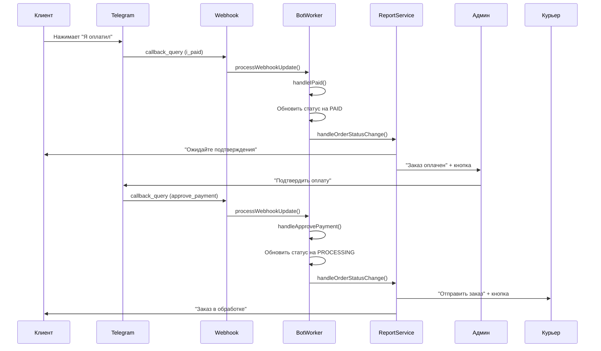

# Процесс обработки платежа через Telegram бота

## Обзор процесса

При нажатии кнопки "Я оплатил" в Telegram происходит следующая последовательность действий:

## 1. Получение callback от Telegram

```
📨 Telegram → Webhook → TelegramBotWorker.handleCallback()
```

- Telegram отправляет callback_query на webhook endpoint `/api/telegram/webhook`
- Webhook обработчик вызывает `TelegramBotWorker.processWebhookUpdate()`
- Определяется тип callback: `i_paid`

## 2. Обработка callback "i_paid"

```typescript
TelegramBotWorker.handleIPaid() {
  1. Находит пользователя по tg_id
  2. Парсит номер заказа из сообщения
  3. Обновляет статус заказа на 1 (paid)
  4. Вызывает ReportService.handleOrderStatusChange()
  5. Отвечает пользователю "Спасибо! Ожидайте подтверждения оплаты."
}
```

## 3. Отправка уведомлений через ReportService

```typescript
ReportService.onPaid() {
  1. Отправляет клиенту: "paid_client" - подтверждение получения оплаты
  2. Отправляет админу: "paid_admin" - детали заказа с кнопкой "Подтвердить оплату"
}
```

## 4. Подтверждение оплаты админом

При нажатии админом кнопки "Подтвердить оплату":

```typescript
TelegramBotWorker.handleApprovePayment() {
  1. Обновляет статус заказа на 2 (processing)
  2. Вызывает ReportService.handleOrderStatusChange()
  3. Удаляет сообщение из чата админа
}
```

## 5. Уведомление курьера

```typescript
ReportService.onProcessing() {
  1. Отправляет курьеру детали заказа с кнопкой "Отправить трек-номер"
  2. Отправляет клиенту подтверждение обработки заказа
}
```

## Диаграмма процесса



## Отладка

Для отладки процесса смотрите логи:

1. **Webhook получение**: `📨 Telegram webhook update:`
2. **Обработка callback**: `📲 Callback: i_paid from ...`
3. **ReportService**: `📊 ReportService: Order X status changed from Y to Z`
4. **TelegramService**: `📤 TelegramService.call:`
5. **Отправка сообщений**: `✅ Message sent to ...`

## Возможные проблемы

1. **Кнопка не реагирует**:
   - Проверьте настройку webhook: `npm run telegram:webhook:info`
   - Убедитесь что ngrok запущен
   - Проверьте логи сервера

2. **Сообщения не отправляются**:
   - Проверьте токен бота в БД
   - Убедитесь что у пользователя есть tg_id
   - Проверьте шаблоны сообщений в БД

3. **Статус не меняется**:
   - Проверьте права доступа к БД
   - Убедитесь что заказ существует
   - Проверьте логи ошибок 