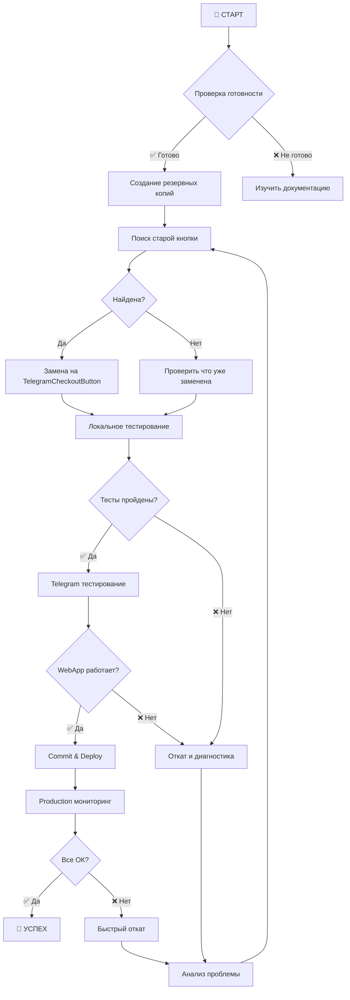

# 🎨 ВИЗУАЛЬНОЕ РУКОВОДСТВО ПО ВНЕДРЕНИЮ TELEGRAM MAINBUTTON

## 📊 Схема процесса внедрения



## 🔄 Состояния кнопки

### 1️⃣ Текущее состояние (сломанная кнопка)
```html
<!-- ❌ Старая кнопка без стилей -->
<div className="checkout-button-container">
  <button className="checkout-button-custom">
    Оформить заказ (5,700 ₽)
  </button>
</div>
```
**Проблемы:**
- Нет стилей для `checkout-button-custom`
- Плохой UX в Telegram
- Нет haptic feedback

### 2️⃣ Промежуточное состояние (после импорта)
```typescript
// ✅ Импорт добавлен
import TelegramCheckoutButton from '../_components/TelegramCheckoutButton';

// ❌ Но старая кнопка все еще используется
<button className="checkout-button-custom">
```

### 3️⃣ Целевое состояние (Telegram MainButton)
```typescript
// ✅ Новый компонент
<TelegramCheckoutButton
  total={finalTotal}
  isLoading={isOrderLoading}
  isDisabled={!isDeliveryFormValid}
  onCheckout={handleTelegramCheckout}
/>
```

## 🎯 Визуальные изменения

### В Telegram WebApp:
```
┌─────────────────────────┐
│    📱 Telegram App      │
│                         │
│   ┌─────────────┐       │
│   │   Корзина   │       │
│   │             │       │
│   │  [Товары]   │       │
│   │             │       │
│   │ [Доставка]  │       │
│   │             │       │
│   └─────────────┘       │
│                         │
│ ╔═══════════════════╗   │
│ ║ Оформить (5700₽) ║   │ ← MainButton (зеленый #48C928)
│ ╚═══════════════════╝   │
└─────────────────────────┘
```

### В обычном браузере:
```
┌─────────────────────────┐
│    🌐 Browser           │
│                         │
│   ┌─────────────┐       │
│   │   Корзина   │       │
│   │             │       │
│   │  [Товары]   │       │
│   │             │       │
│   │ [Доставка]  │       │
│   │             │       │
│   └─────────────┘       │
│                         │
│   ┌─────────────┐       │
│   │ Оформить    │       │ ← Fallback кнопка
│   │ (5700₽)     │       │    (тот же зеленый)
│   └─────────────┘       │
└─────────────────────────┘
```

## 📱 Поведение компонента

### Обычное состояние:
```
╔════════════════════════╗
║   Оформить (5700₽)     ║ → Зеленый фон #48C928
╚════════════════════════╝   Белый текст #FFFFFF
```

### При загрузке:
```
╔════════════════════════╗
║   ⟳ Оформляем...      ║ → Показывается прогресс
╚════════════════════════╝   Кнопка заблокирована
```

### После успеха:
```
╔════════════════════════╗
║   ✓ Заказ оформлен!    ║ → Зеленый успех #34c759
╚════════════════════════╝   WebApp закрывается
```

## 🔍 Где искать в коде

### Файловая структура:
```
src/
├── app/
│   └── webapp/
│       ├── _components/
│       │   └── TelegramCheckoutButton.tsx ← Новый компонент
│       └── cart/
│           ├── page.tsx ← Здесь заменяем кнопку
│           └── page.backup.tsx ← Резервная копия
```

### Строки для поиска:
```typescript
// 🔍 Ищем в районе строки 469-485:
"checkout-button-custom"     // ← Старая кнопка
"Оформить заказ"            // ← Текст кнопки
"{cartItems.length > 0"     // ← Условие отображения
```

## ⚡ Быстрые команды

### Проверка статуса:
```bash
# Есть ли компонент?
ls src/app/webapp/_components/TelegramCheckoutButton.tsx

# Используется ли?
grep -c "TelegramCheckoutButton" src/app/webapp/cart/page.tsx

# Есть ли старая кнопка?
grep -c "checkout-button-custom" src/app/webapp/cart/page.tsx
```

### Быстрый откат:
```bash
# Вернуть оригинал
cp src/app/webapp/cart/page.backup.tsx src/app/webapp/cart/page.tsx

# Перезапустить
pkill -f "next dev" && PORT=3000 npm run dev
```

## 🎨 Цветовая палитра

| Элемент | Цвет | HEX | Использование |
|---------|------|-----|---------------|
| Основной | 🟢 | #48C928 | Фон кнопки |
| Текст | ⚪ | #FFFFFF | Текст на кнопке |
| Hover | 🟢 | #3ba220 | При наведении |
| Успех | 🟢 | #34c759 | После оформления |
| Ошибка | 🔴 | #ff3b30 | При ошибке |

## 📋 Чеклист внедрения

- [ ] 📁 Резервная копия создана
- [ ] 📝 Импорт компонента добавлен
- [ ] �� Старая кнопка заменена
- [ ] 🌐 Протестировано в браузере
- [ ] 📱 Протестировано в Telegram
- [ ] ✅ Заказ успешно оформляется
- [ ] 💚 Кнопка зеленая (#48C928)
- [ ] 📳 Haptic feedback работает
- [ ] 🚀 Готово к production

---

**Визуальное руководство поможет быстро понять что и где менять!**
