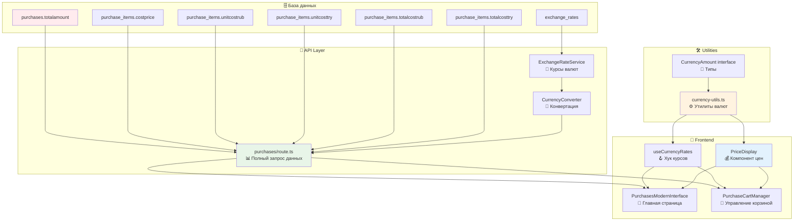

# 🏗️ План исправления отображения цен в закупках

## 📋 Обзор проблемы

На странице закупок http://localhost:3002/purchases некорректно отображаются цены в лирах. После анализа кода выявлены критические проблемы в API, логике конвертации валют и компонентах интерфейса.

### 🎯 Цель
- **Основная валюта отображения:** Рубли (₽)
- **Дополнительная информация:** Лиры (₺) 
- **Источник данных:** Смешанные валюты в БД с автоматической конвертацией
- **Формат отображения:** `1 500 ₽ (≈ 50.2 ₺)`

## 🔍 Анализ текущих проблем

### 🚨 Критические проблемы

#### 1. Неполный запрос в API закупок
**Файл:** `src/app/api/purchases/route.ts:127-138`

```typescript
// ❌ ПРОБЛЕМА: Получаем только id и status
const [purchases, totalCount] = await Promise.all([
  (prisma as any).purchases.findMany({
    select: {
      id: true,
      status: true  // Отсутствуют purchase_items, цены, пользователи
    },
    orderBy: { id: 'desc' },
    skip: offset,
    take: limit
  }),
]);
```

**Последствия:**
- `purchase.purchase_items` undefined
- Невозможно получить цены товаров
- Отсутствуют данные для конвертации валют

#### 2. Неправильная обработка данных
**Файл:** `src/app/api/purchases/route.ts:148-172`

```typescript
// ❌ ПРОБЛЕМА: Обращение к несуществующим данным
const items = purchase.purchase_items?.map((item: any) => {
  // purchase_items не запрашивается в select!
  const unitPrice = item.unitcosttry ? Number(item.unitcosttry) : // undefined
                   item.unitcostrub ? Number(item.unitcostrub) : // undefined
                   item.costprice || 0; // undefined
});
```

#### 3. Отсутствие курса валют в компонентах
**Файл:** `src/components/Purchases/PurchasesModernInterface.tsx:512-514`

```typescript
// ❌ ПРОБЛЕМА: Отображение без конвертации
<p className="text-lg font-semibold text-[#1E293B] dark:text-white">
  {purchase.totalAmount?.toFixed(2) || '0.00'} ₺  {/* Всегда лиры! */}
</p>
```

### ⚠️ Архитектурные проблемы

1. **Отсутствие единой системы валют**
2. **Дублирование логики конвертации**
3. **Несогласованность отображения между компонентами**
4. **Отсутствие типизации для валют**

## 🏗️ Архитектура решения



## 📅 План реализации по фазам

### 🚀 Фаза 1: Инфраструктура валют (Приоритет: КРИТИЧЕСКИЙ)

#### 1.1 Создать типы валют
**Файл:** `src/types/currency.ts` (НОВЫЙ)

```typescript
export type Currency = 'RUB' | 'TRY';

export interface CurrencyAmount {
  value: number;
  currency: Currency;
  displayValue: string;
  convertedValue?: {
    value: number;
    currency: Currency;
    rate: number;
    displayValue: string;
  };
}

export interface ExchangeRate {
  currency: Currency;
  rate: number;
  rateWithBuffer: number;
  effectiveDate: Date;
  source: string;
}

export interface PurchaseItemPrice {
  originalAmount: number;
  originalCurrency: Currency;
  rubAmount: number;
  tryAmount?: number;
  exchangeRate?: number;
  displayFormat: 'primary' | 'both' | 'converted';
}
```

#### 1.2 Создать утилиты валют
**Файл:** `src/lib/currency-utils.ts` (НОВЫЙ)

```typescript
import { Currency, CurrencyAmount } from '@/types/currency';

export class CurrencyUtils {
  // Форматирование валют
  static formatCurrency(amount: number, currency: Currency): string;
  
  // Определение валюты по контексту
  static detectCurrency(item: any): Currency;
  
  // Создание CurrencyAmount
  static createAmount(value: number, currency: Currency): CurrencyAmount;
  
  // Конвертация с актуальным курсом
  static async convertAmount(
    amount: number, 
    from: Currency, 
    to: Currency
  ): Promise<CurrencyAmount>;
}
```

#### 1.3 Создать сервис конвертации
**Файл:** `src/lib/services/currency-converter.service.ts` (НОВЫЙ)

```typescript
export class CurrencyConverterService {
  // Конвертация элементов закупки в рубли
  static async convertPurchaseItemToRub(item: any): Promise<number>;
  
  // Конвертация общей суммы закупки
  static async convertPurchaseTotalToRub(purchase: any): Promise<number>;
  
  // Получение отображаемой цены в обеих валютах
  static async getDisplayPrice(
    amountRub: number, 
    showConverted: boolean = true
  ): Promise<{
    primary: string;    // "1 500 ₽"
    secondary?: string; // "(≈ 50.2 ₺)"
    full: string;       // "1 500 ₽ (≈ 50.2 ₺)"
  }>;
}
```

### 🔧 Фаза 2: Исправление API (Приоритет: КРИТИЧЕСКИЙ)

#### 2.1 Исправить запрос данных
**Файл:** `src/app/api/purchases/route.ts:127-138`

**Было:**
```typescript
// ❌ Неполный запрос
const [purchases, totalCount] = await Promise.all([
  (prisma as any).purchases.findMany({
    select: { id: true, status: true },
    // ...
  }),
]);
```

**Станет:**
```typescript
// ✅ Полный запрос с включением связанных данных
const [purchases, totalCount] = await Promise.all([
  (prisma as any).purchases.findMany({
    where: whereConditions,
    orderBy: orderBy,
    skip: offset,
    take: limit,
    include: {
      purchase_items: {
        include: {
          products: {
            select: {
              id: true,
              name: true
            }
          }
        }
      },
      users: {
        select: {
          id: true,
          email: true,
          first_name: true,
          last_name: true
        }
      }
    }
  }),
  (prisma as any).purchases.count({ where: whereConditions })
]);
```

#### 2.2 Добавить конвертацию валют в API
**Файл:** `src/app/api/purchases/route.ts:148-214`

```typescript
// ✅ Правильная обработка с конвертацией
const serializedPurchases = await Promise.all(
  purchases.map(async (purchase: any) => {
    const items = await Promise.all(
      (purchase.purchase_items || []).map(async (item: any) => {
        // Конвертация в рубли с приоритетом полей
        const rubAmount = await CurrencyConverterService.convertPurchaseItemToRub(item);
        
        return {
          id: String(item.id),
          productId: String(item.productid),
          productName: item.productname || item.products?.name || 'Товар без названия',
          quantity: item.quantity || 0,
          costPriceRub: rubAmount, // Основная цена в рублях
          totalRub: rubAmount * (item.quantity || 0),
          // Дополнительные поля для истории
          originalCostPrice: item.costprice,
          unitCostRub: item.unitcostrub ? Number(item.unitcostrub) : null,
          unitCostTry: item.unitcosttry ? Number(item.unitcosttry) : null,
        };
      })
    );

    // Общая сумма в рублях
    const totalAmountRub = items.reduce((sum, item) => sum + item.totalRub, 0);

    return {
      id: String(purchase.id),
      // ... остальные поля
      totalAmountRub, // ✅ Основная сумма в рублях
      totalAmountDisplay: await CurrencyConverterService.getDisplayPrice(totalAmountRub),
      items,
      // ... остальные поля
    };
  })
);
```

### 🎨 Фаза 3: Обновление компонентов (Приоритет: ВЫСОКИЙ)

#### 3.1 Создать компонент отображения цен
**Файл:** `src/components/common/PriceDisplay.tsx` (НОВЫЙ)

```typescript
interface PriceDisplayProps {
  amountRub: number;
  showConverted?: boolean;
  size?: 'sm' | 'md' | 'lg' | 'xl';
  className?: string;
  loading?: boolean;
}

export const PriceDisplay: React.FC<PriceDisplayProps> = ({
  amountRub,
  showConverted = true,
  size = 'md',
  className = '',
  loading = false
}) => {
  const { data: tryRate, isLoading } = useCurrencyRates('TRY');
  
  if (loading || isLoading) {
    return <div className="animate-pulse bg-gray-200 h-6 w-20 rounded"></div>;
  }

  const tryAmount = tryRate ? amountRub / tryRate : null;
  
  const sizeClasses = {
    sm: 'text-sm',
    md: 'text-base',
    lg: 'text-lg font-semibold',
    xl: 'text-xl font-bold'
  };

  return (
    <div className={`${sizeClasses[size]} ${className}`}>
      <span className="text-[#1E293B] dark:text-white">
        {amountRub.toLocaleString('ru-RU')} ₽
      </span>
      {showConverted && tryAmount && (
        <span className="text-[#64748B] dark:text-gray-400 ml-2">
          (≈ {tryAmount.toFixed(2)} ₺)
        </span>
      )}
    </div>
  );
};
```

#### 3.2 Создать хук для курсов валют
**Файл:** `src/hooks/useCurrencyRates.ts` (НОВЫЙ)

```typescript
interface UseCurrencyRatesResult {
  data: number | null;
  isLoading: boolean;
  error: string | null;
  lastUpdated: Date | null;
}

export const useCurrencyRates = (currency: 'TRY'): UseCurrencyRatesResult => {
  const [data, setData] = useState<number | null>(null);
  const [isLoading, setIsLoading] = useState(true);
  const [error, setError] = useState<string | null>(null);
  const [lastUpdated, setLastUpdated] = useState<Date | null>(null);

  const fetchRate = useCallback(async () => {
    try {
      setIsLoading(true);
      setError(null);
      
      const response = await fetch(`/api/rates/latest?currency=${currency}`);
      if (!response.ok) throw new Error('Failed to fetch rate');
      
      const result = await response.json();
      setData(Number(result.rate));
      setLastUpdated(new Date());
    } catch (err) {
      setError(err instanceof Error ? err.message : 'Unknown error');
      // Fallback курс
      setData(30);
    } finally {
      setIsLoading(false);
    }
  }, [currency]);

  useEffect(() => {
    fetchRate();
    // Обновление каждые 30 минут
    const interval = setInterval(fetchRate, 30 * 60 * 1000);
    return () => clearInterval(interval);
  }, [fetchRate]);

  return { data, isLoading, error, lastUpdated };
};
```

#### 3.3 Обновить PurchasesModernInterface
**Файл:** `src/components/Purchases/PurchasesModernInterface.tsx:512-514`

**Было:**
```typescript
// ❌ Неправильное отображение
<p className="text-lg font-semibold text-[#1E293B] dark:text-white">
  {purchase.totalAmount?.toFixed(2) || '0.00'} ₺
</p>
```

**Станет:**
```typescript
// ✅ Правильное отображение через компонент
<PriceDisplay 
  amountRub={purchase.totalAmountRub || 0}
  showConverted={true}
  size="lg"
  className="text-[#1E293B] dark:text-white"
/>
```

#### 3.4 Обновить отображение товаров в закупке
**Файл:** `src/components/Purchases/PurchasesModernInterface.tsx:602-604`

**Было:**
```typescript
// ❌ Неправильное отображение цены товара
<p className="text-sm text-[#64748B] dark:text-gray-400">
  {item.quantity} шт. × {item.costPrice} ₺
</p>
```

**Станет:**
```typescript
// ✅ Правильное отображение с компонентом
<div className="text-sm text-[#64748B] dark:text-gray-400">
  <span>{item.quantity} шт. × </span>
  <PriceDisplay 
    amountRub={item.costPriceRub || 0}
    showConverted={true}
    size="sm"
    className="inline"
  />
</div>
```

### 🔄 Фаза 4: Унификация компонентов (Приоритет: СРЕДНИЙ)

#### 4.1 Обновить PurchaseCartManager
**Файл:** `src/components/PurchaseCart/PurchaseCartManager.tsx`

- Заменить ручную логику курсов на `useCurrencyRates`
- Использовать `PriceDisplay` для отображения цен
- Убрать дублирующий код конвертации

#### 4.2 Обновить интерфейсы типов
**Файл:** `src/hooks/usePurchases.ts:5-27`

```typescript
// ✅ Обновленные интерфейсы
export interface Purchase {
  id: number;
  totalAmountRub: number;           // ✅ Основная сумма в рублях
  totalAmountDisplay: {             // ✅ Форматированное отображение
    primary: string;
    secondary?: string;
    full: string;
  };
  isUrgent: boolean;
  expenses?: number;
  status: "draft" | "sent" | "sent_to_supplier" | "awaiting_payment" | "paid" | "in_transit" | "received" | "cancelled";
  items: PurchaseItem[];
  createdAt: string;
  updatedAt: string;
}

export interface PurchaseItem {
  id: number;
  productId: number;
  quantity: number;
  costPriceRub: number;             // ✅ Цена в рублях
  totalRub: number;                 // ✅ Итого в рублях
  productName?: string;
  // Дополнительные поля для истории
  originalCostPrice?: number;
  unitCostRub?: number;
  unitCostTry?: number;
}
```

## 📊 Приоритизация задач

### 🚨 Критический уровень (сделать немедленно)
1. **Исправить API запрос данных** - без этого ничего не работает
2. **Добавить конвертацию валют в API** - основа корректных расчетов
3. **Создать CurrencyConverterService** - централизованная логика

### ⚠️ Высокий уровень (сделать в первую очередь)
1. **Создать PriceDisplay компонент** - унифицированное отображение
2. **Обновить PurchasesModernInterface** - главная страница
3. **Создать useCurrencyRates хук** - получение курсов

### 📋 Средний уровень (можно отложить)
1. **Обновить PurchaseCartManager** - второстепенный компонент
2. **Создать типы валют** - улучшение архитектуры
3. **Добавить кэширование курсов** - оптимизация

### 🎯 Низкий уровень (для будущих улучшений)
1. **Исторические курсы для старых закупок**
2. **Офлайн поддержка курсов**
3. **Пользовательские настройки валют**

## 🧪 План тестирования

### Функциональные тесты
- [ ] Корректное отображение цен в рублях
- [ ] Правильная конвертация лир в рубли  
- [ ] Отображение дополнительной информации в лирах
- [ ] Работа с разными статусами закупок

### Интеграционные тесты
- [ ] API возвращает полные данные
- [ ] Компоненты корректно отображают данные из API
- [ ] Курсы валют загружаются правильно

### UI/UX тесты
- [ ] Читаемость цен в разных темах
- [ ] Корректное отображение на мобильных устройствах
- [ ] Состояния загрузки и ошибок

## 📈 Метрики успеха

### Технические метрики
- [ ] 0 ошибок в консоли браузера
- [ ] Время загрузки страницы < 2 сек
- [ ] API отвечает за < 500мс

### Пользовательские метрики
- [ ] Понятное отображение цен
- [ ] Последовательность валют во всех компонентах
- [ ] Правильные расчеты сумм

## 🚀 Готовность к запуску

### Чек-лист перед переключением в код-режим
- [x] План детализирован и структурирован
- [x] Приоритеты расставлены  
- [x] Архитектура проработана
- [x] Техническое решение понятно
- [ ] Переключение в код-режим для реализации

---

**Следующий шаг:** Переключиться в код-режим и начать реализацию с исправления API закупок (критический приоритет).