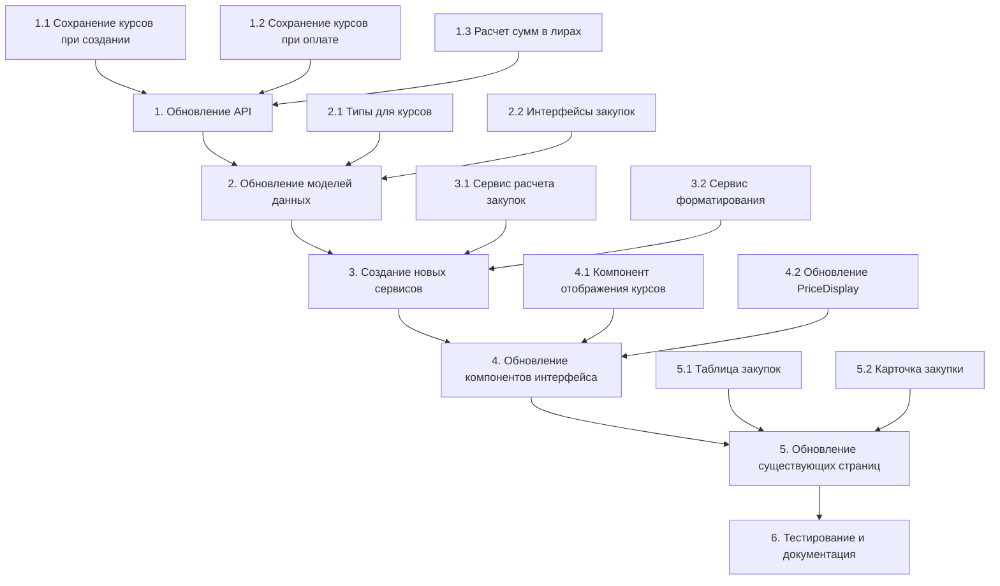

# План реализации функционала курсов валют для закупок

## 🎯 Цель
Реализовать полный функционал отображения и расчета курсов валют для закупок с правильным сохранением курсов на момент оформления и оплаты.

## 📊 Текущее состояние системы

### Преимущества:
- База данных уже содержит нужные поля (`exchangerate`, `paidexchangerate`, `totalcosttry`)
- Есть система курсов валют (`ExchangeRateService`)
- Есть компоненты для отображения цен (`PriceDisplay`)

### Проблемы:
- Курсы не сохраняются при создании/оплате закупок
- Интерфейс не показывает все три суммы согласно требованиям
- Логика расчетов не учитывает исторические курсы

## 🗂 Архитектура решения



## 📋 Требования к реализации

### Обязательные элементы:
1. **Себестоимость в лирах** - берется из базы данных товаров
2. **Курс лиры к рублю** на момент оформления закупки
3. **Сумма в рублях** на момент оформления = (себестоимость × курс на момент оформления)
4. При оплате закупки дополнительно:
   - Сохранить курс лиры к рублю на момент оплаты
   - Рассчитать сумму в рублях на момент оплаты = (себестоимость × курс на момент оплаты)

### Формат отображения:
- **Итого в лирах**: `13 000 ₺`
- **Итого в рублях (оформление)**: `≈ 27 000 ₽`
- **Итого в рублях (оплата)**: `≈ 28 600 ₽` (если есть)

## 🔧 Этап 1: Обновление API

### 1.1 Модификация `/api/purchases` - создание закупки

**Файл**: `src/app/api/purchases/route.ts`

```typescript
// В POST методе добавить:
export async function POST(request: NextRequest) {
  // ... existing code ...
  
  // 🆕 Получаем текущий курс лиры
  const currentTryRate = await ExchangeRateService.getLatestRate('TRY');
  
  // 🆕 Рассчитываем сумму в лирах
  const totalAmountTry = totalAmount / Number(currentTryRate.rateWithBuffer);
  
  const newPurchase = await (tx as any).purchases.create({
    data: {
      totalamount: totalAmount, // в рублях
      totalcosttry: totalAmountTry, // 🆕 в лирах
      exchangerate: currentTryRate.rateWithBuffer, // 🆕 курс на момент создания
      isurgent: Boolean(isUrgent),
      expenses: expenses || null,
      userid: mainUser.id,
    }
  });
  
  // ... остальной код
}
```

### 1.2 Модификация обновления статуса закупки

**Файл**: `src/app/api/purchases/[id]/status/route.ts`

```typescript
export async function PUT(request: NextRequest, { params }: { params: { id: string } }) {
  const { status } = await request.json();
  
  const updateData: any = { status };
  
  // 🆕 Если статус меняется на "paid", сохраняем курс оплаты
  if (status === 'paid') {
    const currentTryRate = await ExchangeRateService.getLatestRate('TRY');
    updateData.paiddate = new Date();
    updateData.paidexchangerate = currentTryRate.rateWithBuffer;
  }
  
  const updatedPurchase = await (prisma as any).purchases.update({
    where: { id: parseInt(params.id) },
    data: updateData
  });
  
  return NextResponse.json(updatedPurchase);
}
```

### 1.3 Обновление GET метода для включения курсов

```typescript
// В convertPurchasesBatch добавить обогащение данными о курсах
const enrichedPurchases = await Promise.all(
  purchases.map(async (purchase) => {
    const amounts = PurchaseCalculationService.calculatePurchaseAmounts(purchase);
    const displayAmounts = PurchaseCalculationService.formatDisplayAmounts(amounts);
    
    return {
      ...purchase,
      amounts,
      displayAmounts,
      exchangeRates: amounts.rates
    };
  })
);
```

## 🏗 Этап 2: Обновление моделей данных

### 2.1 Расширение типов валют

**Файл**: `src/types/currency.ts`

```typescript
export interface PurchaseExchangeRates {
  createdRate: number; // курс на момент создания
  paidRate?: number;   // курс на момент оплаты (если есть)
  createdDate: Date;
  paidDate?: Date;
}

export interface PurchaseAmounts {
  try: number;                    // сумма в лирах
  rubAtCreated: number;          // сумма в рублях на момент создания
  rubAtPaid?: number;            // сумма в рублях на момент оплаты
  rates: PurchaseExchangeRates;
}

export interface PurchaseDisplayAmounts {
  try: string;        // "13 000 ₺"
  rubCreated: string; // "≈ 27 000 ₽"
  rubPaid?: string;   // "≈ 28 600 ₽"
}
```

### 2.2 Обновление интерфейсов закупок

**Файл**: `src/hooks/usePurchases.ts`

```typescript
export interface Purchase {
  // ... existing fields ...
  
  // 🆕 Новые поля для курсов
  exchangeRates: PurchaseExchangeRates;
  amounts: PurchaseAmounts;
  displayAmounts: PurchaseDisplayAmounts;
  
  // Поля из базы данных
  exchangerate?: number;      // курс на момент создания
  paidexchangerate?: number;  // курс на момент оплаты
  totalcosttry?: number;      // сумма в лирах
  paiddate?: string;          // дата оплаты
}
```

## ⚙️ Этап 3: Создание новых сервисов

### 3.1 Сервис расчета закупок

**Файл**: `src/lib/services/purchase-calculation.service.ts`

```typescript
export class PurchaseCalculationService {
  /**
   * Расчет всех сумм закупки с учетом курсов
   */
  static calculatePurchaseAmounts(purchase: any): PurchaseAmounts {
    const tryAmount = Number(purchase.totalcosttry || 0);
    const createdRate = Number(purchase.exchangerate || 0);
    const paidRate = purchase.paidexchangerate ? Number(purchase.paidexchangerate) : undefined;
    
    return {
      try: tryAmount,
      rubAtCreated: tryAmount * createdRate,
      rubAtPaid: paidRate ? tryAmount * paidRate : undefined,
      rates: {
        createdRate,
        paidRate,
        createdDate: new Date(purchase.createdat),
        paidDate: purchase.paiddate ? new Date(purchase.paiddate) : undefined
      }
    };
  }
  
  /**
   * Форматирование для отображения согласно требованиям
   */
  static formatDisplayAmounts(amounts: PurchaseAmounts): PurchaseDisplayAmounts {
    return {
      try: `${amounts.try.toLocaleString('tr-TR', { maximumFractionDigits: 0 })} ₺`,
      rubCreated: `≈ ${amounts.rubAtCreated.toLocaleString('ru-RU', { maximumFractionDigits: 0 })} ₽`,
      rubPaid: amounts.rubAtPaid 
        ? `≈ ${amounts.rubAtPaid.toLocaleString('ru-RU', { maximumFractionDigits: 0 })} ₽` 
        : undefined
    };
  }
  
  /**
   * Проверка наличия курса оплаты
   */
  static hasPaidRate(purchase: any): boolean {
    return Boolean(purchase.paidexchangerate && purchase.paiddate);
  }
  
  /**
   * Расчет разности курсов
   */
  static calculateRateDifference(amounts: PurchaseAmounts): {
    difference: number;
    percentage: number;
    isProfit: boolean;
  } | null {
    if (!amounts.rubAtPaid) return null;
    
    const difference = amounts.rubAtPaid - amounts.rubAtCreated;
    const percentage = (difference / amounts.rubAtCreated) * 100;
    
    return {
      difference,
      percentage,
      isProfit: difference > 0
    };
  }
}
```

### 3.2 Обновление сервиса конвертации

**Файл**: `src/lib/services/currency-converter.service.ts`

```typescript
// Добавить новый метод
static async enrichPurchaseWithAmounts(purchase: any): Promise<any> {
  const amounts = PurchaseCalculationService.calculatePurchaseAmounts(purchase);
  const displayAmounts = PurchaseCalculationService.formatDisplayAmounts(amounts);
  
  return {
    ...purchase,
    amounts,
    displayAmounts,
    exchangeRates: amounts.rates
  };
}

// Обновить convertPurchasesBatch
static async convertPurchasesBatch(purchases: any[]): Promise<any[]> {
  try {
    const convertedPurchases = await Promise.all(
      purchases.map(async (purchase) => {
        try {
          // 🆕 Обогащаем данными о курсах
          const enrichedPurchase = await this.enrichPurchaseWithAmounts(purchase);
          
          // ... существующая логика конвертации items ...
          
          return enrichedPurchase;
        } catch (purchaseError) {
          console.warn(`Failed to convert purchase ${purchase.id}:`, purchaseError);
          return purchase; // Возвращаем исходные данные
        }
      })
    );

    return convertedPurchases;
  } catch (error) {
    console.error('Failed to convert purchases batch:', error);
    return purchases;
  }
}
```

## 🎨 Этап 4: Обновление компонентов интерфейса

### 4.1 Новый компонент для отображения курсов

**Файл**: `src/components/Purchases/PurchaseAmountDisplay.tsx`

```typescript
import React from 'react';
import { PurchaseAmounts, PurchaseDisplayAmounts } from '@/types/currency';
import { PurchaseCalculationService } from '@/lib/services/purchase-calculation.service';

interface PurchaseAmountDisplayProps {
  amounts: PurchaseAmounts;
  displayAmounts: PurchaseDisplayAmounts;
  size?: 'sm' | 'md' | 'lg';
  variant?: 'compact' | 'detailed';
  showRateInfo?: boolean;
}

export const PurchaseAmountDisplay: React.FC<PurchaseAmountDisplayProps> = ({
  amounts,
  displayAmounts,
  size = 'md',
  variant = 'compact',
  showRateInfo = false
}) => {
  const rateDiff = PurchaseCalculationService.calculateRateDifference(amounts);
  
  const sizeClasses = {
    sm: { main: 'text-sm', secondary: 'text-xs', icon: 'text-base' },
    md: { main: 'text-base', secondary: 'text-sm', icon: 'text-lg' },
    lg: { main: 'text-lg font-semibold', secondary: 'text-base', icon: 'text-xl' }
  };
  
  const classes = sizeClasses[size];
  
  if (variant === 'compact') {
    return (
      <div className="flex items-center gap-4">
        {/* Сумма в лирах */}
        <div className="flex items-center gap-1">
          <span className={`${classes.icon} text-blue-600`}>₺</span>
          <span className={`${classes.main} text-blue-600 font-semibold`}>
            {displayAmounts.try}
          </span>
        </div>
        
        {/* Сумма в рублях на момент оформления */}
        <div className="flex items-center gap-1">
          <span className={`${classes.icon} text-green-600`}>₽</span>
          <span className={`${classes.secondary} text-green-600`}>
            {displayAmounts.rubCreated}
          </span>
        </div>
        
        {/* Сумма в рублях на момент оплаты */}
        {displayAmounts.rubPaid && (
          <div className="flex items-center gap-1">
            <span className={`${classes.icon} text-emerald-600`}>₽</span>
            <span className={`${classes.secondary} text-emerald-600 font-medium`}>
              {displayAmounts.rubPaid}
            </span>
            {rateDiff && (
              <span className={`text-xs ${rateDiff.isProfit ? 'text-green-500' : 'text-red-500'}`}>
                ({rateDiff.isProfit ? '+' : ''}{rateDiff.percentage.toFixed(1)}%)
              </span>
            )}
          </div>
        )}
      </div>
    );
  }
  
  return (
    <div className="space-y-3">
      {/* Заголовок */}
      <h4 className="text-sm font-medium text-gray-700 dark:text-gray-300">
        Валютная информация
      </h4>
      
      {/* Сумма в лирах */}
      <div className="flex items-center justify-between p-3 bg-blue-50 dark:bg-blue-900/20 rounded-lg">
        <div className="flex items-center gap-2">
          <span className="text-xl text-blue-600">₺</span>
          <span className="text-sm text-gray-600 dark:text-gray-400">Итого лиры:</span>
        </div>
        <span className="text-lg font-semibold text-blue-600">
          {displayAmounts.try}
        </span>
      </div>
      
      {/* Сумма в рублях на момент оформления */}
      <div className="flex items-center justify-between p-3 bg-green-50 dark:bg-green-900/20 rounded-lg">
        <div className="flex items-center gap-2">
          <span className="text-xl text-green-600">₽</span>
          <div className="flex flex-col">
            <span className="text-sm text-gray-600 dark:text-gray-400">Итого рубли (оформление):</span>
            {showRateInfo && (
              <span className="text-xs text-gray-500">
                Курс: {amounts.rates.createdRate.toFixed(4)} ₽/₺
              </span>
            )}
          </div>
        </div>
        <span className="text-lg font-semibold text-green-600">
          {displayAmounts.rubCreated}
        </span>
      </div>
      
      {/* Сумма в рублях на момент оплаты */}
      {displayAmounts.rubPaid && (
        <div className="flex items-center justify-between p-3 bg-emerald-50 dark:bg-emerald-900/20 rounded-lg border-2 border-emerald-200 dark:border-emerald-800">
          <div className="flex items-center gap-2">
            <span className="text-xl text-emerald-600">₽</span>
            <div className="flex flex-col">
              <span className="text-sm text-gray-600 dark:text-gray-400">Итого рубли (оплата):</span>
              {showRateInfo && amounts.rates.paidRate && (
                <span className="text-xs text-gray-500">
                  Курс: {amounts.rates.paidRate.toFixed(4)} ₽/₺
                </span>
              )}
            </div>
          </div>
          <div className="text-right">
            <span className="text-lg font-bold text-emerald-600">
              {displayAmounts.rubPaid}
            </span>
            {rateDiff && (
              <div className={`text-xs mt-1 ${rateDiff.isProfit ? 'text-green-500' : 'text-red-500'}`}>
                {rateDiff.isProfit ? '▲' : '▼'} {Math.abs(rateDiff.difference).toLocaleString('ru-RU')} ₽
                ({rateDiff.isProfit ? '+' : ''}{rateDiff.percentage.toFixed(1)}%)
              </div>
            )}
          </div>
        </div>
      )}
      
      {/* Информация о датах */}
      {showRateInfo && (
        <div className="text-xs text-gray-500 space-y-1 pt-2 border-t border-gray-200 dark:border-gray-700">
          <div>Создано: {amounts.rates.createdDate.toLocaleDateString('ru-RU')} в {amounts.rates.createdDate.toLocaleTimeString('ru-RU')}</div>
          {amounts.rates.paidDate && (
            <div>Оплачено: {amounts.rates.paidDate.toLocaleDateString('ru-RU')} в {amounts.rates.paidDate.toLocaleTimeString('ru-RU')}</div>
          )}
        </div>
      )}
    </div>
  );
};

export default PurchaseAmountDisplay;
```

### 4.2 Компонент для компактного отображения

**Файл**: `src/components/common/PriceDisplay.tsx` (дополнение)

```typescript
// Добавить новый компонент для закупок
interface PurchasePriceDisplayProps {
  purchase: {
    amounts: PurchaseAmounts;
    displayAmounts: PurchaseDisplayAmounts;
  };
  variant?: 'compact' | 'detailed';
  size?: 'sm' | 'md' | 'lg';
}

export const PurchasePriceDisplay: React.FC<PurchasePriceDisplayProps> = ({
  purchase,
  variant = 'compact',
  size = 'md'
}) => {
  return (
    <PurchaseAmountDisplay 
      amounts={purchase.amounts}
      displayAmounts={purchase.displayAmounts}
      variant={variant}
      size={size}
      showRateInfo={variant === 'detailed'}
    />
  );
};
```

## 📱 Этап 5: Обновление существующих страниц

### 5.1 Модификация таблицы закупок

**Файл**: `src/components/Purchases/PurchasesModernInterface.tsx`

```typescript
// В секции отображения суммы (около строки 528)
<div>
  <p className="text-sm text-[#64748B] dark:text-gray-400">Сумма</p>
  {/* 🆕 Заменяем старый PurchaseTotalDisplay */}
  <PurchasePriceDisplay 
    purchase={purchase}
    variant="compact"
    size="md"
  />
</div>
```

### 5.2 Модификация развернутой карточки

```typescript
// В развернутой секции (около строки 598)
{isExpanded && (
  <div className="border-t border-gray-200 dark:border-gray-700 p-6 bg-[#F8FAFC] dark:bg-gray-700/50">
    {/* 🆕 Детальная информация о суммах и курсах */}
    <div className="mb-6">
      <PurchaseAmountDisplay 
        amounts={purchase.amounts}
        displayAmounts={purchase.displayAmounts}
        variant="detailed"
        showRateInfo={true}
      />
    </div>
    
    {/* Прогресс статуса */}
    <div className="mb-6">
      <PurchaseStatusFlow 
        currentStatus={purchase.status} 
        isInteractive={false}
      />
    </div>

    {/* ... остальной контент */}
  </div>
)}
```

### 5.3 Обновление аналитики

**Файл**: `src/components/Purchases/PurchaseAnalytics.tsx`

```typescript
// Добавить аналитику по курсам валют
const currencyAnalytics = useMemo(() => {
  const paidPurchases = purchases.filter(p => p.displayAmounts?.rubPaid);
  
  if (paidPurchases.length === 0) return null;
  
  const totalGainLoss = paidPurchases.reduce((sum, purchase) => {
    const rateDiff = PurchaseCalculationService.calculateRateDifference(purchase.amounts);
    return sum + (rateDiff?.difference || 0);
  }, 0);
  
  return {
    totalGainLoss,
    profitablePurchases: paidPurchases.filter(p => {
      const rateDiff = PurchaseCalculationService.calculateRateDifference(p.amounts);
      return rateDiff?.isProfit;
    }).length,
    totalPaidPurchases: paidPurchases.length
  };
}, [purchases]);

// В секции статистики добавить карточку валютной аналитики
{currencyAnalytics && (
  <div className="bg-white dark:bg-gray-800 rounded-xl border border-gray-200 dark:border-gray-700 p-6">
    <h3 className="text-lg font-semibold text-[#1E293B] dark:text-white mb-4">
      Валютная аналитика
    </h3>
    <div className="grid grid-cols-1 md:grid-cols-3 gap-4">
      <div>
        <p className="text-sm text-[#64748B] dark:text-gray-400">Общая прибыль/убыток</p>
        <p className={`text-xl font-bold ${currencyAnalytics.totalGainLoss >= 0 ? 'text-green-600' : 'text-red-600'}`}>
          {currencyAnalytics.totalGainLoss >= 0 ? '+' : ''}{currencyAnalytics.totalGainLoss.toLocaleString('ru-RU')} ₽
        </p>
      </div>
      <div>
        <p className="text-sm text-[#64748B] dark:text-gray-400">Прибыльных закупок</p>
        <p className="text-xl font-bold text-green-600">
          {currencyAnalytics.profitablePurchases} из {currencyAnalytics.totalPaidPurchases}
        </p>
      </div>
      <div>
        <p className="text-sm text-[#64748B] dark:text-gray-400">Успешность</p>
        <p className="text-xl font-bold text-blue-600">
          {((currencyAnalytics.profitablePurchases / currencyAnalytics.totalPaidPurchases) * 100).toFixed(1)}%
        </p>
      </div>
    </div>
  </div>
)}
```

## 🧪 Этап 6: Тестирование

### 6.1 Модульные тесты

**Файл**: `src/lib/services/__tests__/purchase-calculation.test.ts`

```typescript
import { PurchaseCalculationService } from '../purchase-calculation.service';

describe('PurchaseCalculationService', () => {
  const mockPurchase = {
    totalcosttry: 1000,
    exchangerate: 30,
    paidexchangerate: 32,
    createdat: '2024-01-01T00:00:00Z',
    paiddate: '2024-01-02T00:00:00Z'
  };

  test('должен правильно рассчитывать суммы', () => {
    const amounts = PurchaseCalculationService.calculatePurchaseAmounts(mockPurchase);
    
    expect(amounts.try).toBe(1000);
    expect(amounts.rubAtCreated).toBe(30000);
    expect(amounts.rubAtPaid).toBe(32000);
  });
  
  test('должен корректно форматировать отображение', () => {
    const amounts = PurchaseCalculationService.calculatePurchaseAmounts(mockPurchase);
    const display = PurchaseCalculationService.formatDisplayAmounts(amounts);
    
    expect(display.try).toBe('1.000 ₺');
    expect(display.rubCreated).toBe('≈ 30.000 ₽');
    expect(display.rubPaid).toBe('≈ 32.000 ₽');
  });
  
  test('должен правильно рассчитывать разность курсов', () => {
    const amounts = PurchaseCalculationService.calculatePurchaseAmounts(mockPurchase);
    const diff = PurchaseCalculationService.calculateRateDifference(amounts);
    
    expect(diff?.difference).toBe(2000);
    expect(diff?.percentage).toBeCloseTo(6.67, 2);
    expect(diff?.isProfit).toBe(true);
  });
});
```

### 6.2 Интеграционные тесты

**Файл**: `src/lib/services/__tests__/purchase-api-integration.test.ts`

```typescript
import { POST } from '@/app/api/purchases/route';

describe('Purchase API Integration', () => {
  test('должен сохранять курс при создании закупки', async () => {
    const mockRequest = new Request('http://localhost/api/purchases', {
      method: 'POST',
      body: JSON.stringify({
        items: [{ productId: 1, quantity: 1, costPrice: 100, total: 100, productName: 'Test' }],
        totalAmount: 100,
        isUrgent: false
      })
    });

    const response = await POST(mockRequest);
    const data = await response.json();
    
    expect(data.exchangerate).toBeDefined();
    expect(data.totalcosttry).toBeDefined();
  });
});
```

## 📚 Этап 7: Документация

### 7.1 Обновление README

Добавить в основной README секцию о валютном функционале:

```markdown
## Валютный функционал

Система автоматически сохраняет курсы валют на момент создания и оплаты закупок:

- При создании закупки сохраняется текущий курс лиры к рублю
- При оплате закупки сохраняется курс на момент оплаты
- В интерфейсе отображаются три суммы: в лирах, в рублях на момент создания и в рублях на момент оплаты
```

### 7.2 API документация

**Файл**: `docs/api/purchases.md`

```markdown
# Purchases API

## POST /api/purchases

Создает новую закупку с автоматическим сохранением текущего курса валют.

### Новые поля ответа:
- `exchangerate` - курс лиры к рублю на момент создания
- `totalcosttry` - сумма закупки в лирах

## PUT /api/purchases/{id}/status

При смене статуса на "paid" автоматически сохраняется:
- `paiddate` - дата оплаты
- `paidexchangerate` - курс лиры к рублю на момент оплаты
```

## ⏱ Временные затраты

| Этап | Описание | Время |
|------|----------|-------|
| 1-2 | Обновление API и моделей | 2-3 дня |
| 3-4 | Создание сервисов и компонентов | 2-3 дня |
| 5 | Обновление интерфейса | 1-2 дня |
| 6-7 | Тестирование и документация | 1-2 дня |

**Итого**: 6-10 дней разработки

## 🎯 Ожидаемый результат

После реализации плана:

1. ✅ **Автоматическое сохранение курсов** при создании и оплате закупок
2. ✅ **Корректное отображение** всех трех сумм согласно требованиям
3. ✅ **Валютная аналитика** с расчетом прибыльности операций
4. ✅ **Обратная совместимость** с существующими данными
5. ✅ **Подробная документация** и тесты

### Формат отображения:
- 💙 **Итого лиры**: `13 000 ₺`
- 💚 **Итого рубли (оформление)**: `≈ 27 000 ₽`
- 💎 **Итого рубли (оплата)**: `≈ 28 600 ₽` *(если есть)*

## 🚀 Готовность к реализации

План полностью готов к реализации. Все компоненты спроектированы с учетом существующей архитектуры системы и обеспечивают плавный переход к новому функционалу.