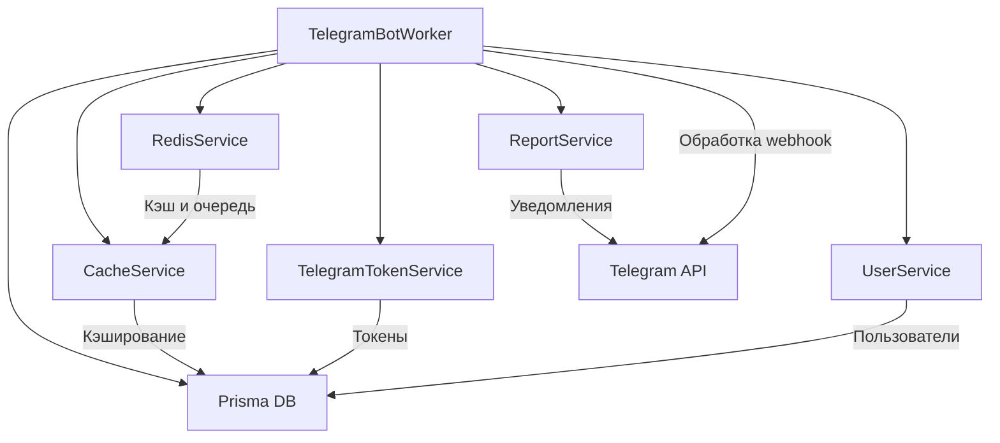

# План улучшений TelegramBotWorker

## 1. Исправление импорта prisma
- Заменить импорт prisma с `'libs/prismaDb'` на `'@/libs/prismaDb'` для корректной работы.

## 2. Рефакторинг кода
- Вынести проверку, является ли пользователь администратором, в отдельный метод `isAdmin(chatId: number): boolean`.
- Вынести отправку сообщений с логированием в отдельный метод `sendMessage(chatId: number, text: string, options?: TelegramBot.SendMessageOptions)`.
- Вынести обработку ошибок с возможностью уведомления админа в отдельный метод `handleError(error: any, context?: string)`.
- Разделить крупные методы (например, `handleMessage`, `handleCallback`) на более мелкие логические части.
- Использовать `CacheService` для загрузки настроек бота вместо прямого обращения к `prisma`.

## 3. Улучшение типизации
- Добавить типы для параметров и возвращаемых значений методов.
- Использовать интерфейсы и типы из `node-telegram-bot-api` для сообщений и callback'ов.
- Типизировать внутренние состояния и кэш.

## 4. Улучшение обработки ошибок и логирования
- Добавить более детальные логи с контекстом.
- В методе `processError` добавить возможность отправки уведомлений администратору.
- Обрабатывать возможные ошибки при работе с Redis и базой данных.

## 5. Оптимизация работы с Redis и кэшем
- Использовать `CacheService` для работы с кэшем настроек и других данных.
- Проверить и оптимизировать TTL для кэшируемых данных.
- Убедиться, что состояние пользователя в Redis корректно очищается и обновляется.

## 6. Добавление комментариев и документации
- Добавить JSDoc комментарии к методам и классам.
- Объяснить логику ключевых частей кода.

## 7. Безопасность и валидация
- Добавить валидацию входящих данных (например, callback data).
- Проверить, что все внешние данные обрабатываются безопасно.

## 8. Возможное улучшение архитектуры
- Рассмотреть внедрение Dependency Injection для сервисов (если поддерживается архитектурой).
- Разделить логику бизнес-правил и взаимодействия с Telegram API.

---

## Диаграмма компонентов и взаимодействий

---

Пожалуйста, подтвердите, если план вас устраивает, или предложите изменения.